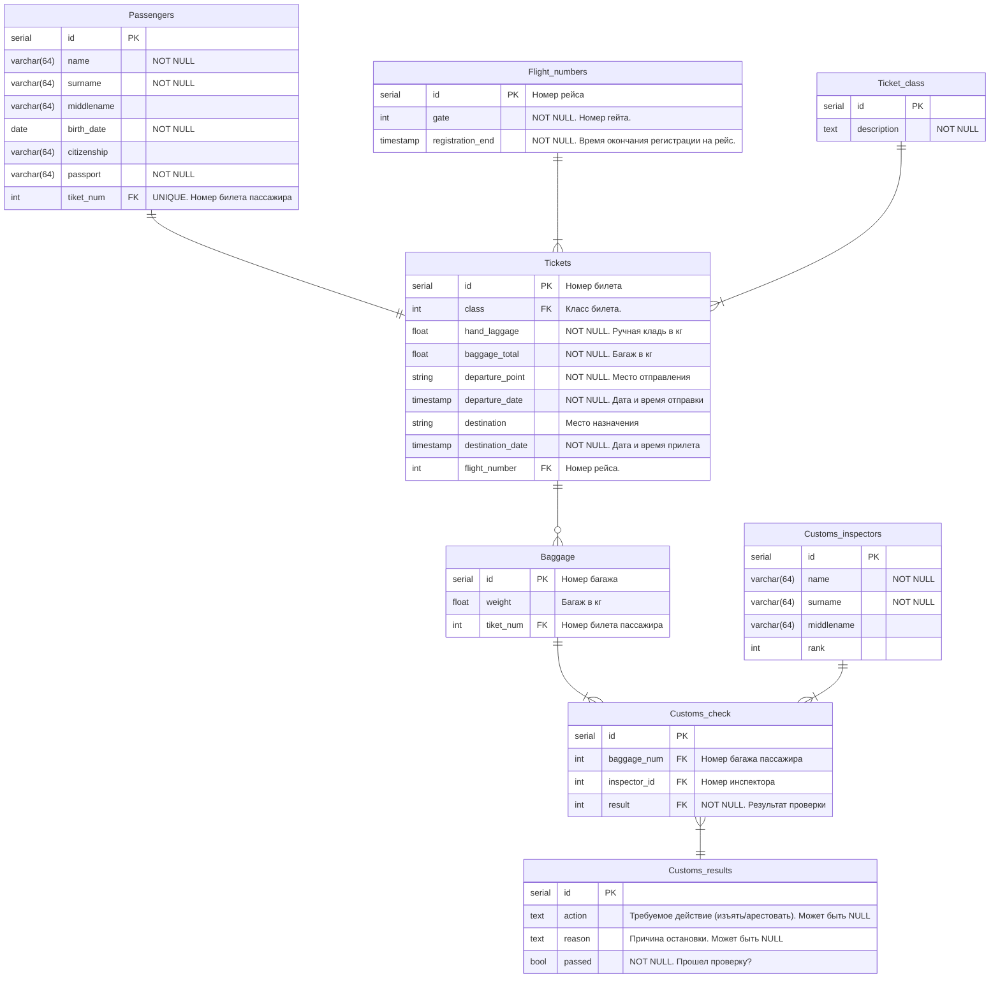

# Рубежный котроль БД <hr>

## Содержание:
* [Задания](#Задания) 
* [Варианты предметных областей](#Варианты-предметных-областей)
* [Теория](#Теория)
* [Реализация](#Реализация) 
  
## Задания

**Задание 1.**

Придумать ER-модель и нарисовать даталогическую модель для предложенной предметной области. Минимум - 8 сущностей, связь многие-ко-кногим, один-к-одному.

**Задание 2.**

Привести DDL для реализации сущностей, которые учавствуют в связях многие-ко-кногим, один-к-одному (связи тоже должны присутствовать в коде).

**Задание 3.**

Сформулировать задачу, для решения которой нужно использовать запрос с ***ANY*** (для вариантов ***1, 2, 3, 8***), ***LEFT JOIN***
(для вариантов ***4, 5, 6, 7***) в рамках вашей предметной области.
Привести условие задачи и запрос для её решения. Задача должно иметь практический смысл в рамках предметной области.
<hr>

## Варианты предметных областей
1. Прокат самокатов<br>
2. Музыкальный концерт<br>
3. Питомник для животных<br>
4. Боулинг<br>
5. Уборка снега зимой<br>
6. <br>
7. Салон красоты <br>
8. Таможня в аэропорту<br>
<hr>

## Теория


## Реализация

<b>Задание 1.</b>

<p>Придумать ER-модель и нарисовать даталогическую модель для предложенной предметной области. Минимум - 8 сущностей, связь многие-ко-кногим, один-к-одному.</p>



Связь многие ко многим реализована в сущности Customs_check, множество багажных сумок проверяют множество инспекторов и проверки имеют разный статус.

Связь один к одному реализована между сущностями Passanger и Ticket. 1 пассажир может иметь только 1 билет.


<b>Задание 2.</b>

<p>Привести DDL для реализации сущностей, которые учавствуют в связях многие-ко-кногим, один-к-одному (связи тоже должны присутствовать в коде).</p>

1) 1 к 1
   
```sql
-- Создание таблицы "passengers"
CREATE TABLE passengers (
    id SERIAL PRIMARY KEY,
    name VARCHAR(64) NOT NULL,
    surname VARCHAR(64) NOT NULL,
    middlename VARCHAR(64),
    birth_date DATE NOT NULL,
    citizenship VARCHAR(64),
    passport VARCHAR(64) NOT NULL,
    ticket_num INT UNIQUE REFERENCES tickets(id)
);

-- Создание таблицы "tickets"
CREATE TABLE tickets (
    id SERIAL PRIMARY KEY,
    class INT REFERENCES ticket_class(id),
    hand_luggage FLOAT NOT NULL,
    baggage_total FLOAT NOT NULL,
    departure_point VARCHAR(64) NOT NULL,
    departure_date TIMESTAMP NOT NULL,
    destination VARCHAR(64),
    destination_date TIMESTAMP NOT NULL,
    flight_number INT REFERENCES flight_numbers(id)
);

```

2) 1 к *

```sql
-- Создание таблицы "baggage"
CREATE TABLE baggage (
    id SERIAL PRIMARY KEY,
    weight FLOAT NOT NULL,
    ticket_num INT REFERENCES tickets(id)
);

-- Создание таблицы "customs_inspectors"
CREATE TABLE customs_inspectors (
    id SERIAL PRIMARY KEY,
    name VARCHAR(64) NOT NULL,
    surname VARCHAR(64) NOT NULL,
    middlename VARCHAR(64),
    rank INT
);

-- Создание таблицы "customs_check"
CREATE TABLE customs_check (
    id SERIAL PRIMARY KEY,
    baggage_num INT REFERENCES baggage(id),
    inspector_id INT REFERENCES customs_inspectors(id),
    result INT REFERENCES customs_results(id)
);

-- Создание таблицы "customs_results"
CREATE TABLE customs_results (
    id SERIAL PRIMARY KEY,
    action TEXT,
    reason TEXT,
    passed BOOLEAN NOT NULL
);
```

<b>Задание 3.</b>

<p>Сформулировать задачу, для решения которой нужно использовать запрос с <i>ANY</i> (для вариантов <i>1, 2, 3, 8</i>)</span>, <i>LEFT JOIN</i>
(для вариантов <i>4, 5, 6, 7</i>) в рамках вашей предметной области.
Привести условие задачи и запрос для её решения. Задача должно иметь практический смысл в рамках предметной области.</p>

Запрос 2 в 1 (LEFT JOIN + ANY):

Вывести уникальный идентификатор и ФИО пассажиров который летят в столицу США или России, если такие есть.

```sql
SELECT
    passengers.id AS passenger_id,
    CONCAT(passengers.surname, ' ', passengers.name, ' ', COALESCE(passengers.middlename, '')) AS passenger_name
FROM
    passengers
LEFT JOIN
    tickets ON passengers.tiket_num = tickets.id
WHERE
    tickets.destination = ANY(ARRAY['Vashington', 'Moscow']);
```


