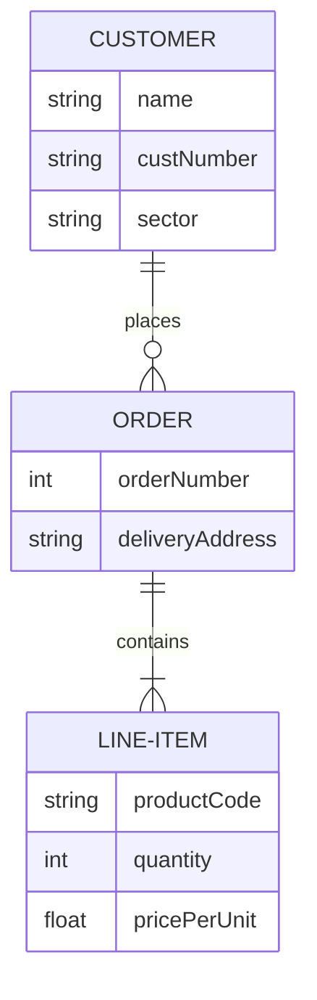

# Рубежный котроль БД 

## Содержание:
* [Задания](-tasks) 
* [Варианты предметных областей](-subject_area_options)
* [Теория](-theory)
* [Реализация](-realization) 

## [Задания:](#tasks)

**Задание 1.**

Придумать ER-модель и нарисовать даталогическую модель для предложенной предметной области. Минимум - 8 сущностей, связь многие-ко-кногим, один-к-одному.

**Задание 2.**

Привести DDL для реализации сущностей, которые учавствуют в связях многие-ко-кногим, один-к-одному (связи тоже должны присутствовать в коде).

**Задание 3.**

Сформулировать задачу, для решения которой нужно использовать запрос с ***ANY*** (для вариантов ***1, 2, 3, 8***), ***LEFT JOIN***
(для вариантов ***4, 5, 6, 7***) в рамках вашей предметной области.
Привести условие задачи и запрос для её решения. Задача должно иметь практический смысл в рамках предметной области.

## [Варианты предметных областей](#subject_area_options)
1. Прокат самокатов 
2. Музыкальный концерт 
3. Питомник для животных 
4. Боулинг 
5. Уборка снега зимой 
6.  
7. Салон красоты  
8. Таможня в аэропорту 

## [Теория](#theory)

## [Реализация](#realization) 

<b>Задание 1.</b>

Придумать ER-модель и нарисовать даталогическую модель для предложенной предметной области. Минимум - 8 сущностей, связь многие-ко-кногим, один-к-одному.

<b>Задание 2.</b>

Привести DDL для реализации сущностей, которые учавствуют в связях многие-ко-кногим, один-к-одному (связи тоже должны присутствовать в коде).

<b>Задание 3.</b>

Сформулировать задачу, для решения которой нужно использовать запрос с <i>ANY</i> (для вариантов <i>1, 2, 3, 8</i>), <i>LEFT JOIN</i>
(для вариантов <i>4, 5, 6, 7</i>) в рамках вашей предметной области.
Привести условие задачи и запрос для её решения. Задача должно иметь практический смысл в рамках предметной области.

